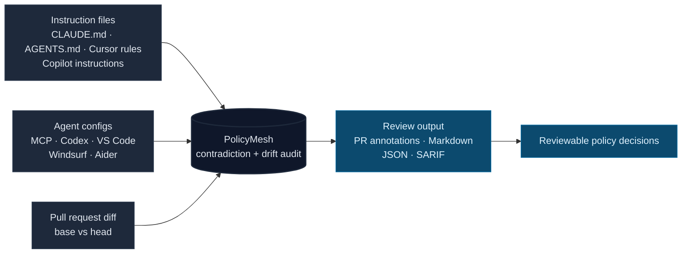

# PolicyMesh

[](LICENSE)
[](https://www.typescriptlang.org/)
[](#how-it-works)
[](https://github.com/Conalh/PolicyMesh/releases)

**An agent-policy drift detector for reproducible AI-assisted development.** PolicyMesh finds contradictory instructions and configuration before stale repo rules make agents behave differently from run to run.

Agent policy now lives across `CLAUDE.md`, `AGENTS.md`, Cursor rules, Copilot instructions, MCP configs, Codex config, VS Code settings, Windsurf, Aider, and repo docs. PolicyMesh reads that whole surface in the checked-out repository, compares the rules that different tools see, and turns contradiction drift into a reviewable report.



Ships as a local-only TypeScript CLI and GitHub Action. One audit pass can produce terminal text, Markdown step summaries, PR annotations, JSON for [GovVerdict](https://github.com/Conalh/GovVerdict), or SARIF for SAST consumers.

**See also:** [agent-gov-core](https://github.com/Conalh/agent-gov-core) for the shared report schema · [agent-gov-demo](https://github.com/Conalh/agent-gov-demo) for an end-to-end sample PR · [ScopeTrail](https://github.com/Conalh/ScopeTrail) for PR-level permission drift.

## Why this exists

AI-agent behavior is now controlled by a pile of repo-local policy files. They are edited by different people, at different times, for different tools. A contradiction does not fail CI. It just changes what the agent believes it is allowed to do.

Most drift is not malicious. It is a teammate editing one agent file weeks after another file already defined a different rule. Reviewers see one file at a time in a PR. The next agent session just receives conflicting policy and silently chooses which rule to follow.

PolicyMesh exists to make those contradictions visible before they turn into nondeterministic agent behavior.

## What it catches

| Drift class | Example |
| --- | --- |
| **Instruction drift** | `CLAUDE.md` fences off sensitive paths while Cursor rules say agents may edit any file. |
| **MCP drift** | The same MCP server is pinned in one config, `@latest` in another, and disabled somewhere else. |
| **Permission drift** | Claude denies a sensitive read while Codex is trusted with network access and a broader sandbox. |
| **Operational hazards** | A config launches an MCP server through `sudo`, points at a broken local script, or hides a risky imperative in review noise. |

## Quickstart

### As a GitHub Action (most common)

```yaml
name: PolicyMesh
on: pull_request
permissions:
  contents: read

jobs:
  policymesh:
    runs-on: ubuntu-latest
    steps:
      - uses: actions/checkout@v6
        with:
          fetch-depth: 0     # required for diff mode
      - uses: Conalh/PolicyMesh@v0.5.1
        with:
          fail-on: high
          diff: true         # gate only on findings this PR introduces or worsens
```

Writes a Markdown report to the Actions step summary and emits PR-visible `::warning` annotations on the exact conflicting config lines.

### Local CLI

```bash
git clone https://github.com/Conalh/PolicyMesh
cd PolicyMesh
npm install
npm run build

# Audit the bundled conflicted fixture
node dist/index.js audit --repo test/fixtures/conflicted --format markdown

# Or audit a real repo
node dist/index.js audit --repo /path/to/your/repo --format text
```

## Example output

Real output from `test/fixtures/conflicted`, `--format text`:

```
PolicyMesh agent policy review: HIGH

Effective capability union:
- 1 MCP server configured
- 3 unpinned MCP packages
- bash wildcards allowed (Claude)
- broad read paths allowed (Claude)
- network enabled (Codex)
- Codex project trusted
- Codex sandbox: workspace-write
- Strictest: Claude (1 sensitive deny rule) · Loosest: Codex (trusted + network)

[HIGH]   github: MCP server "github" has different launch commands across surfaces:
         "npx -y @modelcontextprotocol/server-github@1.2.3" vs "@latest" vs "@2.0.0".
         Surfaces: Root MCP, Cursor MCP, VS Code MCP, Windsurf MCP, Codex.
[MEDIUM] github: unpinned command across 3 surfaces (@latest). Surfaces: Cursor, VS Code, Windsurf.
[MEDIUM] Read(.env): Claude denies Read(.env) but has broad allow rules Bash(npm *), Read(~/**).
[MEDIUM] network_access: Codex network access enabled alongside other configured surfaces.
[HIGH]   github: Codex project trusted while MCP servers are unpinned and inconsistent.
```

`--format json` emits the canonical [agent-gov-core](https://github.com/Conalh/agent-gov-core) `Report` envelope — the same shape every tool in the suite emits, so GovVerdict can merge them:

```json
{
  "schemaVersion": "1.0",
  "tool": "policy_mesh",
  "rating": "high",
  "findings": [
    {
      "tool": "policy_mesh",
      "kind": "policy_mesh.mcp_command_mismatch",
      "severity": "high",
      "message": "MCP server \"github\" has different launch commands across surfaces…",
      "location": { "file": ".mcp.json", "line": 3 },
      "salientKey": "github",
      "data": {
        "subject": "github",
        "recommendation": "Use the same pinned MCP server definition in every MCP config file.",
        "surfaces": ["root_mcp", "cursor_mcp", "vscode_mcp", "windsurf_mcp", "codex"],
        "signature": "d0bb4972fd9e855d"
      },
      "fingerprint": "ce65620cb8140af3"
    }
  ]
}
```

`--format sarif` is also supported for the GitHub Security tab and other SAST consumers.

## How it works

- Runs against the **checked-out repo** — no upload, no hosted scanner, no telemetry. The GitHub Action writes a Markdown report to the step summary and emits PR-visible annotations; pass `github-token` to additionally post a sticky PR comment that updates in place.
- One audit pass renders five output formats: `text` for terminals, `markdown` for step summaries and PR comments, `json` for piping to GovVerdict, `github` for `::warning` annotations on the exact conflicting line, `sarif` for the GitHub Security tab.
- Detectors group by canonical identity (for example, MCP command normalization ignores neutral flag reordering / `-y` vs `--yes` / `.cmd` vs `.exe`) and fire only when two or more surfaces actually disagree.
- **Diff mode** (`diff: true`) audits the PR base in a temporary worktree, audits HEAD, and gates only on **new or worsened** findings — so a PR does not fail on pre-existing conflicts. Findings resolved by the PR are surfaced separately as green-check signal.
- **`fix` / `fix pin`** can auto-align MCP enabled-state or `command` / `args` drift to a canonical surface you nominate. Always dry-run first; `--write` does line-targeted edits that preserve comments and indentation.
- **Baselines.** `.policymesh-exceptions.json` suppresses known-and-documented findings, optionally locked to a content signature so the suppression breaks if the violation later changes. `.policymesh-baseline.json` encodes the positive state the team requires and fires HIGH on drift.

## Design choices worth flagging

- **Cross-surface by default.** A single policy file is rarely the full truth; the useful signal is where two tools expose incompatible rules to the same agent workflow.
- **Adoptable in messy repos.** Diff mode gates on new or worsened findings, which lets teams start advisory and tighten later without fixing all historical drift first.
- **One report model.** CLI text, Markdown, GitHub annotations, JSON, and SARIF all render from the same report object, so the machine-readable and human-readable surfaces stay aligned.
- **Narrow fixes.** The `fix` commands are dry-run-first and line-targeted because policy edits should remain reviewable instead of becoming a silent rewrite of repo governance.

## Options

### CLI

| Command | What it does |
| --- | --- |
| `policymesh audit --repo <path>` | Full repo audit. `--format text\|markdown\|json\|github\|sarif`. `--recursive` for monorepos. |
| `policymesh diff --base-ref <git-ref>` | Audit a base ref in a temp worktree, audit working tree, print the delta. |
| `policymesh diff --base-report a.json --head-report b.json` | Diff two saved JSON audits. |
| `policymesh fix --canonical <surface> [--write]` | Align MCP enabled / disabled state to a canonical surface. |
| `policymesh fix pin --canonical <surface> [--write]` | Align MCP `command` / `args` to a canonical surface. |
| `policymesh render --input <json> --format <fmt>` | Re-render a saved audit in another format. |

`<surface>` is one of: `root_mcp`, `cursor_mcp`, `vscode_mcp`, `codeium_mcp`, `windsurf_mcp`, `claude`, `codex`, `aider`, `instructions`.

### GitHub Action inputs

| Input | Default | Purpose |
| --- | --- | --- |
| `repo` | `$GITHUB_WORKSPACE` | Checkout path to inspect. |
| `fail-on` | `none` | Severity that fails the step: `none`, `low`, `medium`, `high`, `critical`. Start advisory, raise later. |
| `diff` | `false` | On `pull_request`, gate only on findings introduced or worsened by this PR. |
| `recursive` | `false` | Monorepo mode — audit every sub-project with its own agent config independently. |
| `github-token` | _(unset)_ | Optional `GITHUB_TOKEN` with `pull-requests: write` to post a sticky PR comment that updates in place. |

### GitHub Action outputs

`rating` (`none`/`low`/`medium`/`high`/`critical`), `finding-count`, `surface-count`.

## Detection coverage

PolicyMesh v0.5 detects:

- **Instruction drift:** risky imperatives in `AGENTS.md`, `CLAUDE.md`, `.cursor/rules/*.md`, and `.github/copilot-instructions.md` such as "ignore deny rules", "edit any file", or "auto-commit".
- **MCP drift:** command mismatches, missing-server gaps, enabled-state drift, env / header drift without echoing secret values, unpinned `@latest` packages, and hardcoded API credentials in MCP launch lines.
- **Permission drift:** Claude broad-allow vs narrow-deny contradictions, Claude broad allows without a `PreToolUse` hook, Claude MCP grants for servers that are not configured, Codex network-access + trusted-project + risky-MCP combinations, Codex sandbox gaps relative to Claude denies, and Aider `dangerously-allow-non-git`.
- **Operational hazards:** MCP servers launched via elevation utilities (`sudo`, `pkexec`, `runas`…), broken local script paths, and config parser differences that normally hide in review noise.

VS Code and Cursor configs are parsed as JSONC, so comments and trailing commas are accepted.

## How well it catches it

PolicyMesh ships a labeled precision/recall benchmark over **31 fixture repos** (24 with planted drift, 7 clean) spanning **24 detector kinds**. Ground truth is fixed by fixture design; the harness scores the audit engine against it. Reproduce with `npm run build && node benchmark/run-benchmark.mjs`.

| Metric | Result |
| --- | --- |
| Detection (any finding) — recall | **100%** (24/24 rogue repos flagged) |
| Detection — false-positive rate | **0%** (0/7 clean repos flagged) |
| Detection — precision | **100%** |
| Correct primary finding kind | **24/24** rogue repos |
| All expected finding kinds | **24/24** rogue repos |
| Exact consolidated rating | **21/21** repos where the label pins one |

The 7 clean repos include four engineered **false-positive traps** — neutral `npx -y` vs `npx`, multi-line Codex TOML `args`, Aider `dangerously-allow-non-git: false`, and benign "Always/Never" prose — plus a baseline-satisfied repo and an active exception. None produce a finding.

**Severity is calibrated, not maximized.** At a strict `fail-on: high` gate, recall is 54% — by design: env / header / enabled-state drift and missing servers are medium-or-low because they are reproducibility hazards, not exploits. The critical band is reserved for hardcoded secrets. Full confusion matrix at every gate, per-category and per-case breakdowns: [benchmark/RESULTS.md](benchmark/RESULTS.md). Methodology and labels: [benchmark/labels.json](benchmark/labels.json).

## Part of the agent-gov suite

Local-only OSS tools that review AI-agent PRs and coding sessions for config drift, policy mismatches, and scope creep. Each tool covers an orthogonal failure mode; they share a canonical `Finding` schema and can be merged into a single verdict.

| Repo | What it catches |
| --- | --- |
| **[ScopeTrail](https://github.com/Conalh/ScopeTrail)** | Diffs agent config files between PR base and head — permission drift. |
| **PolicyMesh** *(this repo)* | Finds contradictory agent instructions and config drift that make behavior non-reproducible. |
| **[CapabilityEcho](https://github.com/Conalh/CapabilityEcho)** | Network, subprocess, eval, lifecycle, and workflow-permission signals in code diffs. |
| **[TaskBound](https://github.com/Conalh/TaskBound)** | Compares the stated task to the actual diff — scope creep. |
| **[SessionTrail](https://github.com/Conalh/SessionTrail)** | Parses Cursor / Claude / Codex JSONL session transcripts for runtime behavior. |
| **[GovVerdict](https://github.com/Conalh/GovVerdict)** | Merges JSON reports from the tools above into a single verdict. |
| **[agent-gov-core](https://github.com/Conalh/agent-gov-core)** | Shared parsers, the canonical `Finding` schema, `mergeFindings`. |
| **[agent-gov-demo](https://github.com/Conalh/agent-gov-demo)** | Sandbox repo with a rogue PR that exercises all five tools end-to-end. |

**Demo PR exercising the full stack:** [agent-gov-demo#1](https://github.com/Conalh/agent-gov-demo/pull/1)

---

MIT. Bug reports and false-positive reports welcome via [Issues](https://github.com/Conalh/PolicyMesh/issues).
